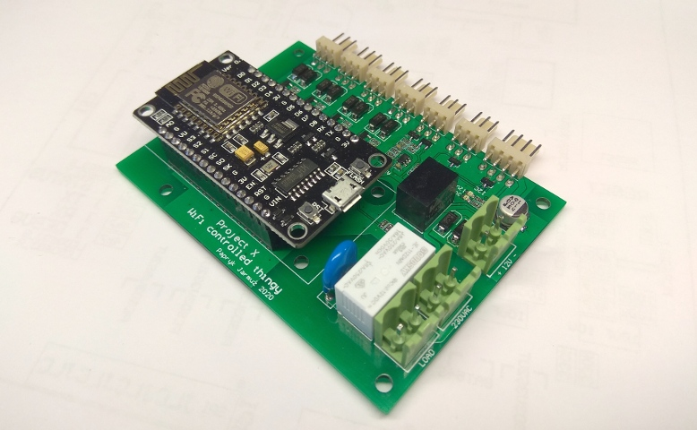

# Project X

Micropython project for GPIO control and atmospheric measurements over WiFi network.



### Features
* easy configuration using webserver
* publishing measurements in Thingspeak
* NTP time synchronization
* time controlled relay switch and PWM outputs

### Hardware
ESP8266 NodeMCU v3 and dedicated PCB supporting:
* 4x PWM outputs, 12V/3A
* 1x relay output, 250VAC/8A
* DHT21 temperature and humidity sensor
* universal I2C bus (*currently not supported by firmware*)
* 3.3V analog input (*currently not supported by firmware*) 

### Changelog

#### v1.1

- auto-reboot after multiple consecutive MQTT errors
- fixed local time in case of NTP synchronization error after reboot
- added simplified summertime detection

#### v1.0

- finished main application
- added install and config instructions

### Installation
1. Open command line and go to `utils/esptool-master`
2. Install Micropython interpreter (read COM port number in Device Manager)
```
esptool.py --port COM11 erase_flash
esptool.py --port COM11 --baud 115200 write_flash --flash_size=detect 0 binarka_stara.bin
```
3. Open COM port in terminal, push the reset button on NodeMCU board - interpreter should be running:
```python
MicroPython v1.9.1-8-g7213e78d on 2017-06-12; ESP module with ESP8266
Type "help()" for more information.
>>> 
```
4. Install WebREPL, enable it on boot, set your password and reboot
```python
import webrepl_setup
E
password
password
Y
```
5. Connect to your local WiFi network and wait until ifconfig returns valid data
```python
import network
sta = network.WLAN(network.STA_IF)
sta.active(True)
sta.connect("ssid", "password")
sta.ifconfig()
```
6. Open `utils/webrepl-master/webrepl.html`, type correct IP, connect with previously set password. A wireless command prompt should appear.
7. Send all files from `scripts/` folder using `Send to device` button
8. Disconnect and reset the board. If you are connected via debug uart, you can see what's happening.

### Configuration
1. Reboot the board using RST push button.
2. While blue led is blinking, push FLASH button to enter configuration mode.
3. The board will activate its own Access Point using the following credentials:
    ```python
    AP_SSID = 'PROJECT_X'
    AP_PASSWORD = 'P4prykowe'
    ```
    You can change it in `scripts/boot.py`.
4. Connect to the AP and run http://192.168.4.1/ .
5. Type in required configuration, especially your local WiFi credentials (and Thingspeak data, if you intend to use it).
6. After pushing Save button, there should be a message confirming that data has been saved. You can now restart te board either by using a web button or by pushing RST button.