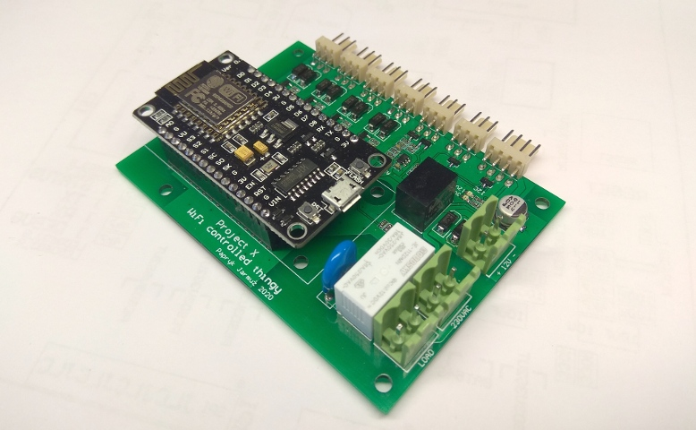
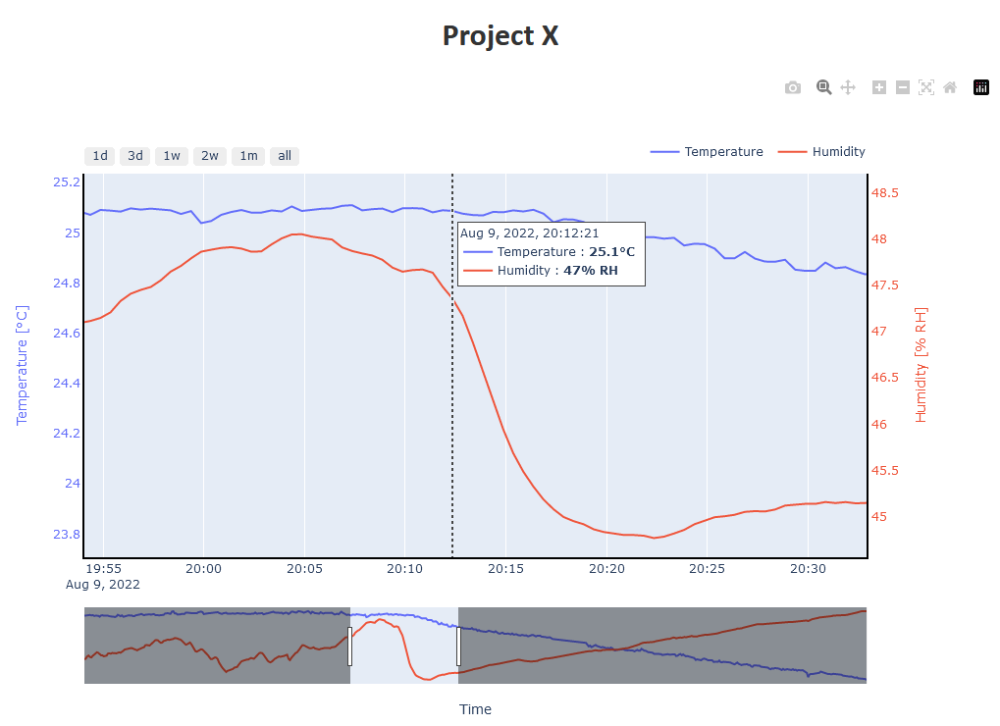

# Project X

Micropython project for GPIO control and atmospheric measurements over WiFi network.





## Features
* easy configuration using webserver
* interactive web visualizer for collected data
* simple TCP client-server communication with client-side data cache in case of server absence
* NTP time synchronization
* time controlled relay switch and PWM outputs

## Hardware
ESP8266 NodeMCU v3 and dedicated PCB supporting:
* 4x PWM outputs, 12V/3A
* 1x relay output, 250VAC/8A
* DHT21 temperature and humidity sensor
* 3.3V analog input (*currently not supported by firmware*) 
* hardware watchdog for auto-reset

## Changelog

### v3.1
- added docker runner for data receive server
- added interactive dash-based visualizer

### v3.0

- changed problematic MQTT communication into simple TCP client-server architecture
- client-side data caching in case of server absence with efficient FLASH usage
- simple matplotlib preview of server data
- remote development improvements (added scripts and VSCode tasks)

### v2.0

- added watchdog support
- added safety reboot
- updated BSP to current version of the board

### v1.1

- auto-reboot after multiple consecutive MQTT errors
- fixed local time in case of NTP synchronization error after reboot
- added simplified summertime detection

### v1.0

- finished main application
- added install and config instructions


## Using TCP server

```bash
# As a python script
cd server
python3 main.py

# With docker, as a service
docker-compose up -d
docker ps
```

Storage data is collected in `binaries/storage.bin` file. It can be displayed in two ways:

- by opening interactive Dash web server (when docker is running):
  [http://localhost:9000](http://localhost:9000)
  <br>
- using static matplotlib graph:
    ```bash
    cd plotter
    python3 main.py
    ```
    this visualizer is in PoC stage. You can use `--help` for extra options, but TBH they aren't even implemented.

## Environment setup for ESP8266

As the project is quite demanding, it is recommended to precompile micropython scripts into frozen bytecode. The following chapters describe some starting point, but small changes might be needed.

1. Install any linux distribution (Ubuntu 20.04.2 LTS on a virtual machine is used in this example)
2. Pull the repo on the development machine
3. Prepare the environment - modify the scripts if needed
    - Install ESP open SDK:
        ```bash
        ./scripts/setup_sdk.sh
        ```
    - Install newest version of micropython (v1.14 is used in this example):
        ```bash
        ./scripts/setup_micropython.sh
        ```
    - Install esptool for flashing the device
        ```bash
        python3 -m pip install esptool
        ```

## Building the project

You can use predefined VS code task (`.vscode/tasks.json`) to run "Rebuild app" task, or do it manually:
```bash
./scripts/rebuild.sh
```
After the build is finished, output binary file is copied to `binaries` directory. I use another location for synchronizing the build with my main machine, so you may need to adjust or remove it.

## Flashing

1. Flash the board with last version of the firmware using predefined VS code task ("Flash") or manually:
    ```bash
    ./scripts/flash.sh /dev/ttyUSBxx
    ```

    *Note: **When the board keeps reseting, open the watchdog jumper (JU1 on the board).** Remember to close it again after flashing is done, to ensure proper operation of watchdog and external reset pushbutton. Red LED indicates watchdog clear signal, it should blink in order to stop the watchdog from resetting the board.*

2. Open serial port in your favourite client (115200 baudrate), re-connect the board and reset it one more time to observe the result:
    ```
    ### Entering Bootloader ###
    WebREPL daemon started on ws://192.168.4.1:8266
    Started webrepl in manual override mode
    [ERR] Missing configuration file: boot.conf. Forcing config mode.
    [ERR] Missing webpage file: boot_index.html. Forcing config mode.
    [CONFIG MODE]
    Access Point started (PROJECT_X,projectx)
    Network info: ('192.168.4.1', '255.255.255.0', '192.168.4.1', '208.67.222.222')
    First run configuration in progress - upload necessary files and reset the board.
    ```

## Initial configuration

1. Connect to the WiFi created by the device:
    ```
    SSID: PROJECT_X
    PASS: projectx
    ```
2. Open webREPL page (`utils/webrepl-master/webrepl.html`) and connect to the device:
    ```
    HOST: ws://192.168.4.1:8266/
    PASS: projectx
    ```
3. Send main index file (`sources/boot_index.html`)
4. Send device configuration file (`sources/boot.conf`)

    *Note: You can manually edit the file, providing your local WiFi credentials and TCP server data. **Then, you won't need to configure the device as described in the next section.***

5. Disconnect from the device.
6. Reset the board using module RST button or the external one.

    *Note: First connection to your local WiFi can take longer time, **which could result in watchdog delay and cause the board to reset**. If you see in the terminal that the board keeps rebooting, then you need to open the watchdog jumper (JU1) for the initial start-up. When the device saves the data, close the jumper again.*

7. From now on, the board is fully operational. When you look at the terminal, it should receive:
    ```
    ### Entering Bootloader ###
    WebREPL daemon started on ws://0.0.0.0:8266
    Started webrepl in manual override mode
    Reading config file.
    {'PWM3_DAY': '90', 'SERVER_PORT': '9999', 'WIFI_PASS': 'x', 'LIGHT_ON': '06:00:00', 'PWM4_DAY': '90', 'LIGHT_OFF': '23:00:00', 'PWM2_DAY': '90', 'PWM1_DAY': '90', 'PWM4_NIGHT': '40', 'PWM3_NIGHT': '40', 'PWM2_NIGHT': '40', 'PWM1_NIGHT': '40', 'WIFI_SSID': 'x', 'SERVER_PUBLISH_PERIOD': '60', 'SERVER_IP': '192.168.0.230'}
    [NORMAL MODE]


    ### Quitting Bootloader ###


    ### Entering Main Application ###
    Reading config file.
    {'PWM3_DAY': '90', 'SERVER_PORT': '0', 'WIFI_PASS': 'x', 'LIGHT_ON': '06:00:00', 'PWM4_DAY': '90', 'LIGHT_OFF': '23:00:00', 'PWM2_DAY': '90', 'PWM1_DAY': '90', 'PWM4_NIGHT': '40', 'PWM3_NIGHT': '40', 'PWM2_NIGHT': '40', 'PWM1_NIGHT': '40', 'WIFI_SSID': 'x', 'SERVER_PUBLISH_PERIOD': '60', 'SERVER_IP': '192.168.0.230'}
    Connecting to WiFi (x)...
    Connected: ('192.168.0.80', '255.255.255.0', '192.168.0.1', '192.168.0.1')
    Synchronized to 2021.06.13 12:29:17
    12:29:18 - DAY TIME
    12:29:19 - DAY TIME
    12:29:20 - DAY TIME
    12:29:21 - DAY TIME
    ```

## Reconfiguring the board using web interface
1. Reboot the board using RST button on ESP module, or external pushbutton.
2. While the blue LED is blinking, push the configuration button (external CONFIG button or FLASH button on ESP module) to enter configuration mode.
3. If you have an active terminal session, you should see:
    ```
    ### Entering Bootloader ###
    WebREPL daemon started on ws://192.168.4.1:8266
    Started webrepl in manual override mode
    Reading config file.
    {'PWM3_DAY': '90', 'PWM1_NIGHT': '40', 'SERVER_IP': '192.168.0.230', 'SERVER_PORT': '9999', 'LIGHT_ON': '06:00:00', 'SERVER_PUBLISH_PERIOD': '60', 'PWM2_DAY': '90', 'PWM1_DAY': '90', 'PWM4_NIGHT': '40', 'PWM3_NIGHT': '40', 'PWM2_NIGHT': '40', 'WIFI_SSID': 'yourssid', 'WIFI_PASS': 'yourpass', 'PWM4_DAY': '90', 'LIGHT_OFF': '23:00:00'}
    [CONFIG MODE]
    Access Point started (PROJECT_X,projectx)
    Network info: ('192.168.4.1', '255.255.255.0', '192.168.4.1', '208.67.222.222')
    Loading webpage...
    Page loaded, escaped 17 instances of '%s'.
    Webserver started on 192.168.4.1:80
    ```

4. Connect a computer/smartphone to the WiFi created by the device:
    ```
    SSID: PROJECT_X
    PASS: projectx
    ```

5. Open the device configuration website: http://192.168.4.1/
6. Type in required configuration, especially your local WiFi credentials.
7. After pushing Save button, there should be a message confirming that data has been saved. You can now restart te board either by using a web button or by pushing any of the reset buttons.

    *Note: First connection to your local WiFi can take longer time, **which could result in watchdog delay and cause the board to reset**. If you see in the terminal that the board keeps rebooting, then you need to open the watchdog jumper (JU1) for the initial start-up. When the device saves the data, close the jumper again.*
